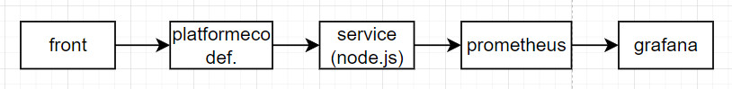
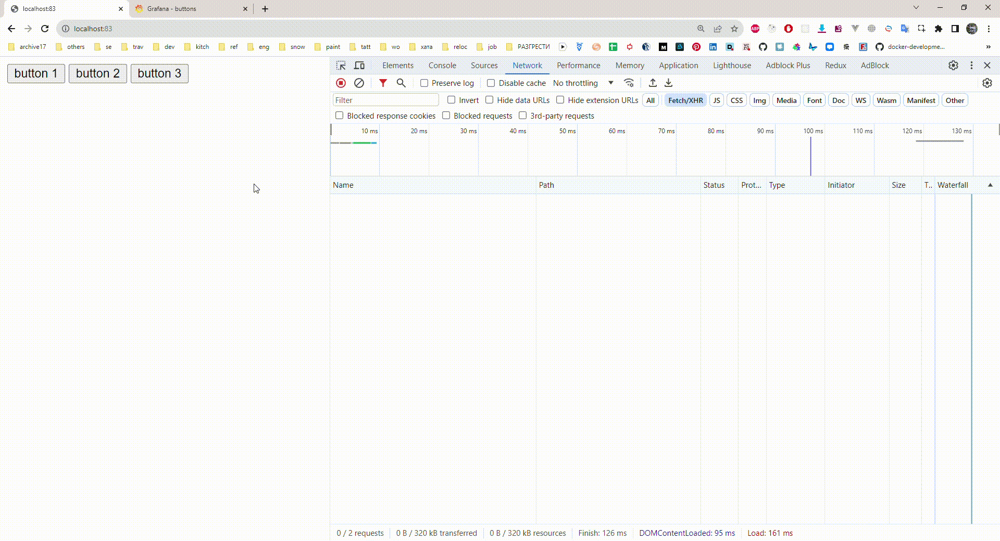

## архитектура решения

## запустить демо локально
1. команда в терминале `docker-compose up -d prometheus && docker-compose up -d grafana && docker-compose up -d grafana-dashboards && docker-compose up -d --build nodejs-application`
2. открыть фронт http://localhost:83
3. открыть дашборд http://localhost:3000/d/pvXvovKWz/buttons?orgId=1

## gif демо
